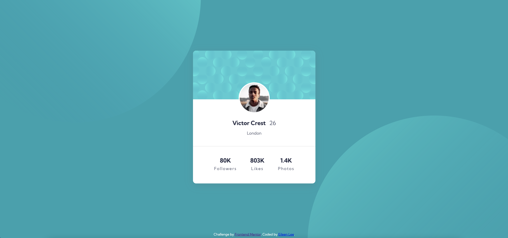

# Frontend Mentor - Profile card component solution

This is a solution to the [Profile card component challenge on Frontend Mentor](https://www.frontendmentor.io/challenges/profile-card-component-cfArpWshJ). Frontend Mentor challenges help you improve your coding skills by building realistic projects. 

## Table of contents

- [Overview](#overview)
  - [The challenge](#the-challenge)
  - [Screenshot](#screenshot)
  - [Links](#links)
- [My process](#my-process)
  - [Built with](#built-with)
  - [What I learned](#what-i-learned)
  - [Continued development](#continued-development)
  - [Useful resources](#useful-resources)
- [Author](#author)
- [Acknowledgments](#acknowledgments)

## Overview

### The challenge

- Build out a Profile card component to the designs provided

### Screenshot



### Links

- Solution URL: [Github]([https://your-solution-url.com](https://github.com/bagelsbagel/pfpcard))
- Live Site URL: [Live Site]([https://your-live-site-url.com](https://bagelsbagel.github.io/pfpcard/))

## My process

I wanted to practice layouts with HTML and CSS since I was still feeling shaky with the Box Model. I placed components in containers and divs, and played around with flexbox, margin, and padding to get the results I wanted.

### Built with

- Semantic HTML5 markup
- CSS custom properties
- Flexbox
- CSS Grid

### What I learned

I didn't expect to have more challenging moments with flexbox and CSS Box Model. I have mostly defaulted to using the standard flexbox properties:

```css
  .container{
    display: flex;
    flex-direction: row;
    align-items: center;
    justify-content: center;
  }
```

But I also learned that is incredibly helpful for making my layouts consistent inside containers. When I set the width to pixels or a percentage, my design would look wonky in varying screen sizes.

```css
  .container{
    width: fit-content;
  }
```

One thing I also learned was placing background images or patterns behind other components. I did this with z-index, indicating where each component lies in the z-axis. A larger z-index number brings an object to the front.

```css
  .container{
    z-index: 100;
  }
```

One last thing - body did not fill up the whole screen. This was really strange, and I couldn't correctly center my container in the middle of the screen like I wanted. I found out that I can make body fill up the screen size with the following:

```css
  html body{
    margin: auto;
    height: 100%;
  }
```

### Continued development

I'd like to continue improving my skills with the Box Model so that I can easily align content in containers. I know there are a couple workarounds to this, but I want my code to be clean and easily understandable, with no extra bells and whistles attached that might break the design in different screen sizes. For the future, I would like to practice responsive design and mobile design.

### Useful resources

- [Box Shadow Examples](https://getcssscan.com/css-box-shadow-examples) - I copied the CSS code with a box shadow I liked for my container. This was an awesome find!
- [How to Center](https://www.freecodecamp.org/news/how-to-center-anything-with-css-align-a-div-text-and-more/) - This is an article that went over basic vertical and horizontal centering of text and divs.

## Author

- Website - [Eileen Lee](https://eileenlee.me/)
- Frontend Mentor - [@bagelsbagel](https://www.frontendmentor.io/profile/bagelsbagel)

## Acknowledgments

Thank you for any future feedback :)
